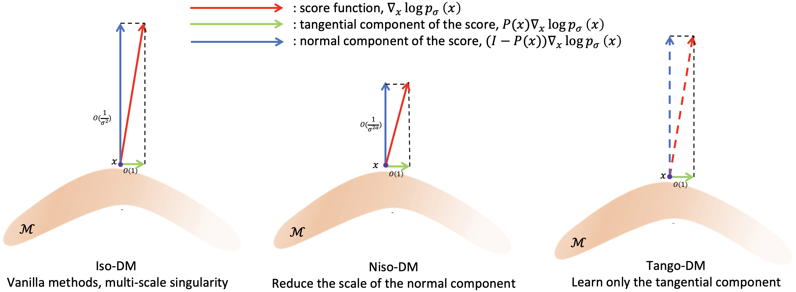

<h3 align="center">Improving the Euclidean Diffusion Generation of Manifold Data by Mitigating Score Function Singularity</h3>

## Abstract:
Euclidean diffusion models have achieved remarkable success in generative modeling across diverse domains, and they have been extended to manifold cases in recent advances. Instead of explicitly utilizing the structure of special manifolds as studied in previous works, in this paper we investigate direct sampling of the Euclidean diffusion models for general manifold-structured data. We reveal the multiscale singularity of the score function in the ambient space, which hinders the accuracy of diffusion-generated samples. We then present an elaborate theoretical analysis of the singularity structure of the score function by decomposing it along the tangential and normal directions of the manifold. To mitigate the singularity and improve the sampling accuracy, we propose two novel methods: (1) Niso-DM, which reduces the scale discrepancies in the score function by utilizing a non-isotropic noise, and (2) Tango-DM, which trains only the tangential component of the score function using a tangential-only loss function. Numerical experiments demonstrate that our methods achieve superior performance on distributions over various manifolds with complex geometries.

<p align="center">
  
</p>


## Experiments


### R2inR3

Execute the training process with:
```
python main.py --multirun experiment=R2inR3_9w \
    training.algo=vesde,vesde_noniso,vesde_projected,vesde_rescale,vesde_noniso_rescale,vesde_proj_rescale  \
    if_cal_distri_dist=True seed=0,1,2,3,4
```

### SOn

To generate the dataset, run the following command:

```
python data/get_SOn_data.py
```

Then, execute the training process with:

```
python main.py --multirun experiment=SO10_5w \
    training.algo=vesde,vesde_noniso,vesde_projected,vesde_rescale,vesde_noniso_rescale,vesde_proj_rescale  \
    if_cal_distri_dist=True seed=0,1,2,3,4
```

### Mesh Data

To generate the dataset, run the following command:

```
python data/get_mesh_data.py
```

Then, execute the training process with:

```
python main.py --multirun experiment=bunny_mix,spot_mix \
    training.algo=vesde,vesde_noniso,vesde_projected,vesde_rescale,vesde_noniso_rescale,vesde_proj_rescale  \
    if_cal_distri_dist=True seed=0,1,2,3,4
```

### Alanine Dipeptide

To generate the dataset, run the following command:

```
python data/get_dipeptide_data.py
```

Then, execute the training process with:

```
python main.py --multirun experiment=dipeptide_l \
    training.algo=vesde,vesde_noniso,vesde_projected,vesde_rescale,vesde_noniso_rescale,vesde_proj_rescale  \
    if_cal_distri_dist=True seed=0,1,2,3,4
```
